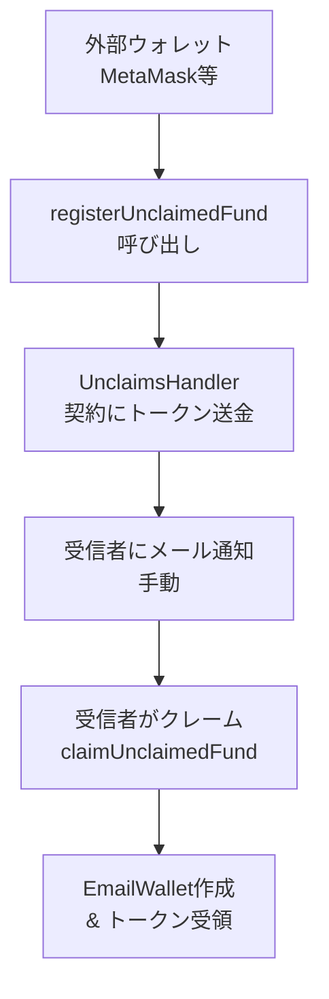

# 既存のregisterUnclaimedFund()機能解説

**EmailWallet本家に既に実装されている外部ウォレット→メールアドレス送金機能**

## 概要

`registerUnclaimedFund()`は、**外部ウォレットユーザー（MetaMaskなど）**がEmailWalletを持っていない人に対して、**メールアドレス宛にトークンを送金**する機能として既に実装されています。

## 基本的な仕組み



## Smart Contract実装

### 1. 未請求資産の構造

```solidity
struct UnclaimedFund {
    uint256 id;                  // 一意のID
    bytes32 emailAddrCommit;     // メールアドレスのハッシュ
    address sender;              // 送信者のアドレス
    address tokenAddr;           // トークンのコントラクトアドレス
    uint256 amount;              // 送金額（wei単位）
    uint256 expiryTime;          // 有効期限（期限後は送信者に返還）
}
```

### 2. 送金関数（registerUnclaimedFund）

```solidity
function registerUnclaimedFund(
    bytes32 emailAddrCommit,              // メールアドレスのハッシュ
    address tokenAddr,                    // トークンアドレス
    uint256 amount,                       // 送金額
    uint256 expiryTime,                   // 有効期限（0なら自動設定）
    uint256 announceCommitRandomness,     // 公開用ランダムネス（オプション）
    string calldata announceEmailAddr    // 公開用メールアドレス（オプション）
) public payable returns (uint256)
```

#### 重要な特徴
- **手数料が必要**: `UNCLAIMED_FUNDS_REGISTRATION_FEE` ETHの支払い必須
- **事前承認**: 送信者はUnclaimsHandler契約への`approve()`が必要
- **有効期限**: デフォルトで30日、期限後は送信者に自動返還可能

### 3. クレーム関数（claimUnclaimedFund）

```solidity
function claimUnclaimedFund(
    uint256 id,                           // 未請求資産のID
    bytes32 recipientAccountSalt,         // 受信者のアカウントソルト
    bytes calldata proof                  // ZK証明（メール所有証明）
) public nonReentrant
```

#### セキュリティ機能
- **Relayer限定**: 登録済みRelayerのみ実行可能
- **ZK証明**: メールアドレス所有の証明が必要
- **期限チェック**: 有効期限内のみクレーム可能

## 実際の使用例

### Step 1: メールアドレスのハッシュ化

```typescript
// メールアドレスをハッシュ化（受信者の秘密情報）
const email = "recipient@gmail.com";
const randomness = ethers.utils.randomBytes(32);
const emailAddrCommit = ethers.utils.keccak256(
  ethers.utils.defaultAbiCoder.encode(
    ["string", "bytes32"],
    [email.toLowerCase(), randomness]
  )
);
```

### Step 2: トークン承認 & 送金

```typescript
// 1. トークンの承認
const token = new ethers.Contract(tokenAddress, ERC20_ABI, signer);
await token.approve(UNCLAIMS_HANDLER_ADDRESS, amount);

// 2. 未請求資産として登録
const unclaimsHandler = new ethers.Contract(
  UNCLAIMS_HANDLER_ADDRESS, 
  UNCLAIMS_HANDLER_ABI, 
  signer
);

const tx = await unclaimsHandler.registerUnclaimedFund(
  emailAddrCommit,
  tokenAddress,
  ethers.utils.parseUnits("10", 6), // 10 USDC
  0, // デフォルト期限使用
  randomness, // 公開（受信者に伝える必要）
  email, // 公開（受信者に伝える必要）
  {
    value: await unclaimsHandler.unclaimedFundClaimGas() // 手数料
  }
);

console.log(`未請求資産ID: ${await tx.wait().events[0].args.id}`);
```

### Step 3: 受信者への通知（手動）

```typescript
// 現状は手動で受信者に以下を通知する必要がある
const notificationData = {
  fundId: fundId,
  randomness: randomness,
  amount: "10 USDC",
  claimUrl: `https://emailwallet.org/claim/${fundId}`
};

// メール送信（手動実装）
await sendEmail(email, notificationData);
```

### Step 4: 受信者のクレーム処理

```typescript
// 受信者は EmailWallet システムを通じてクレーム
// 1. EmailWallet アカウント作成（必要な場合）
// 2. claimUnclaimedFund() をRelayer経由で実行
// 3. ZK証明でメール所有を証明
// 4. トークンを受領
```

## 発見できたイベント

### 1. UnclaimedFundRegistered
```solidity
event UnclaimedFundRegistered(
    uint256 indexed id,
    bytes32 indexed emailAddrCommit,
    address tokenAddr,
    uint256 amount,
    address sender,
    uint256 expiryTime,
    uint256 commitmentRandomness,
    string emailAddr
);
```

### 2. UnclaimedFundClaimed
```solidity
event UnclaimedFundClaimed(
    uint256 indexed id,
    bytes32 indexed emailAddrCommit,
    address tokenAddr,
    uint256 amount,
    address recipient
);
```

### 3. UnclaimedFundVoided
```solidity
event UnclaimedFundVoided(
    uint256 indexed id,
    bytes32 indexed emailAddrCommit,
    address tokenAddr,
    uint256 amount,
    address sender
);
```

## 現在の制限・課題

### ✅ **既に存在する機能**
- 外部ウォレット→メールアドレス送金の基盤
- 安全なトークンエスクロー機能
- ZK証明による受信者認証
- 自動期限切れ返金システム

### ❌ **不足している機能**
1. **DApp統合の複雑さ**: 直接コントラクト呼び出しが必要
2. **メール通知の自動化なし**: 手動でメール送信が必要
3. **フロントエンドライブラリなし**: 開発者向けの簡単なインターフェースがない
4. **ガス代計算の複雑さ**: 手数料計算が煩雑

### 改善が必要な点

#### 1. **開発者体験の向上**
```typescript
// 現状：複雑な実装が必要
const emailCommit = calculateEmailCommit(email, randomness);
await token.approve(handler, amount);
const fee = await handler.unclaimedFundClaimGas();
await handler.registerUnclaimedFund(emailCommit, token, amount, 0, randomness, email, {value: fee});

// 理想：シンプルなライブラリ
await emailPay.sendToEmail({
  to: 'user@gmail.com',
  amount: '10',
  token: 'USDC',
  wallet: signer
});
```

#### 2. **メール通知の自動化**
現状は送金者が手動でメール送信する必要があるが、理想的には：
- 送金と同時に自動メール送信
- クレーム用URLの自動生成
- ステータス追跡機能

#### 3. **ユーザーエクスペリエンスの改善**
- ガス代・手数料の自動計算
- エラーハンドリングの標準化
- トランザクション状況の可視化

## 既存機能との統合戦略

### 提案するライブラリは既存機能のWrapper

```typescript
// 既存のregisterUnclaimedFund()を活用
class WalletToEmailBridge {
  async sendToEmail(params: SendParams): Promise<TransferResult> {
    // 1. パラメータ正規化
    const emailCommit = this._generateEmailCommit(params.toEmail);
    
    // 2. 既存コントラクト呼び出し
    const fundId = await this.unclaimsHandler.registerUnclaimedFund(
      emailCommit.commit,
      params.tokenAddress,
      params.amount,
      0, // デフォルト期限
      emailCommit.randomness,
      params.toEmail,
      { value: await this._calculateFee() }
    );
    
    // 3. 自動メール通知（新機能）
    await this._sendClaimEmail(params.toEmail, fundId);
    
    return { fundId, txHash: tx.hash };
  }
}
```

## まとめ

### **重要な発見**
- **基盤技術は完全に実装済み** - `registerUnclaimedFund()`として既存
- **セキュリティも確保済み** - ZK証明、期限切れ返金、イベント追跡
- **不足しているのは開発者体験** - 簡単なライブラリとメール自動化

### **実装すべき内容**
1. **TypeScript Wrapper Library** - 既存契約の簡単なインターフェース
2. **自動メール通知システム** - Relayer拡張またはサードパーティサービス
3. **React/Vue Components** - DApp統合用UIコンポーネント
4. **ドキュメント・チュートリアル** - 開発者向けガイド

既存の`registerUnclaimedFund()`は**完璧に動作する基盤**として存在しており、あなたの役割は**これを実用化するためのライブラリ層**を構築することです。

---

*作成日: 2025-01-26*
*ベースコントラクト: UnclaimsHandler.sol (email-wallet/packages/contracts/src/handlers/)*
*参考: Types.sol, EmailWalletCore.sol*