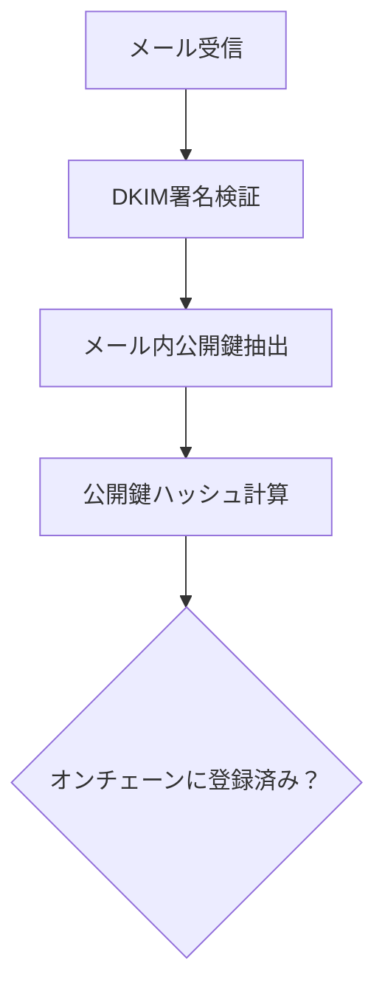
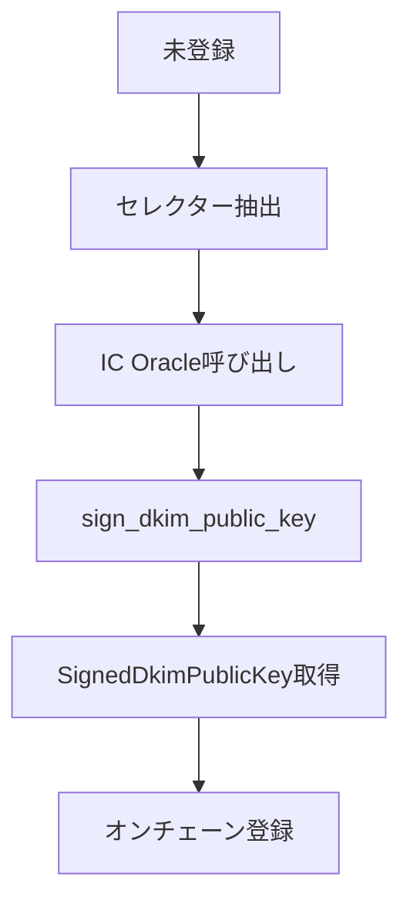
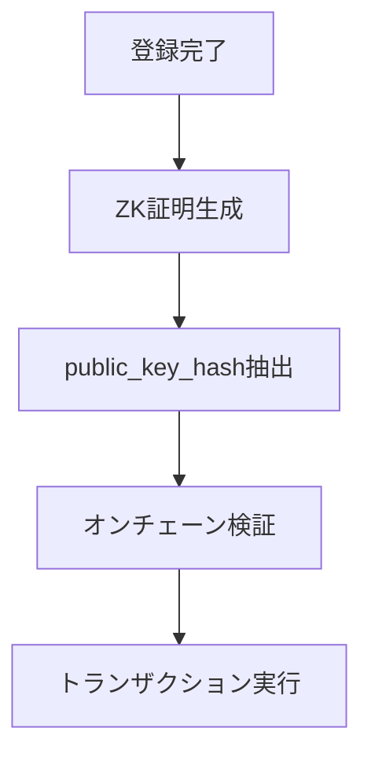
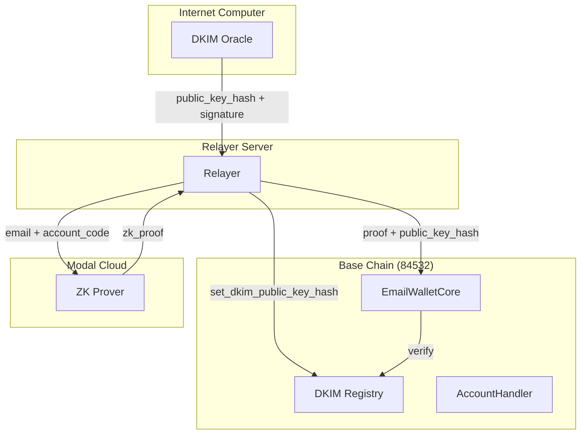

# IC Oracle DKIM公開鍵の使用箇所と処理フロー

## 🔍 調査結果概要

**結論**: IC Oracleから取得したDKIM公開鍵は**プルーバーへの引数としては使用されません**。代わりに、**オンチェーンのDKIM Registry更新**にのみ使用されます。

## 📊 DKIM公開鍵の使用フロー

### 1. IC Oracleによる取得・署名処理
```rust
// core.rs:535 - IC Oracleからの取得
let oracle_result = oracle_client.request_signature(&selector, &domain).await?;
// 戻り値: SignedDkimPublicKey {
//   selector: "20230601._domainkey",
//   domain: "gmail.com", 
//   signature: "0x...",        // IC による署名
//   public_key: "0x...",       // 実際の公開鍵
//   public_key_hash: "0x..."   // 公開鍵のハッシュ
// }
```

### 2. オンチェーンDKIM Registry更新（唯一の使用箇所）
```rust
// core.rs:541-548 - オンチェーン登録
let tx_hash = CLIENT
    .set_dkim_public_key_hash(
        selector,                    // セレクター
        domain,                      // ドメイン  
        public_key_hash,             // IC Oracleから取得したハッシュ
        signature,                   // IC Oracleによる署名
    )
    .await?;
```

### 3. ZK証明での検証（プルーバーは関与しない）
```rust  
// core.rs:55, 331 - ZK証明から公開鍵ハッシュを抽出
dkim_public_key_hash: u256_to_bytes32(&pub_signals[DOMAIN_FIELDS + 0])

// core.rs:499 - オンチェーンでの検証
CLIENT.check_if_dkim_public_key_hash_valid(
    domain.clone(), 
    fr_to_bytes32(&public_key_hash)?
).await?
```

## 🔄 完全な処理フロー

### Phase 1: メール受信・DKIM検証


### Phase 2: IC Oracle連携（未登録時のみ）


### Phase 3: ZK証明生成・実行  


## 📝 重要なポイント

### IC Oracleの役割（限定的）
- ✅ **DKIM公開鍵の取得**: DNSから最新の公開鍵を取得
- ✅ **公開鍵ハッシュの署名**: IC の秘密鍵で署名を付与
- ✅ **オンチェーン登録の認証**: 署名付きデータでDKIM Registryを更新
- ❌ **ZK証明への関与**: プルーバーとは完全に独立

### ZK Prover（Modal）の役割
- ✅ **メール内容の証明**: DKIM署名とメール内容の整合性証明
- ✅ **公開鍵ハッシュの計算**: メール内の公開鍵から直接計算
- ✅ **秘匿証明の生成**: メールアドレスを秘匿しながら認証
- ❌ **IC Oracleデータの使用**: IC から取得した値は使用しない

## 🔐 セキュリティモデル

### 二重検証システム
```typescript
const SecurityModel = {
  // 1. ZK証明による検証（メール内公開鍵使用）
  zkProof: {
    input: "メール内のDKIM公開鍵",
    process: "ハッシュ計算 → 証明生成",
    output: "public_key_hash (pub_signals[0])"
  },
  
  // 2. オンチェーン検証（IC Oracle登録値使用）
  onchainVerification: {
    input: "ZK証明から抽出したハッシュ",
    process: "DKIM Registryとの照合",
    requirement: "IC Oracleによる事前登録必須"
  }
};
```

### 攻撃耐性
- **偽装メール**: ZK証明で検出（メール内公開鍵が無効）
- **古い鍵の悪用**: DKIM Registry未登録で検出
- **IC Oracle改ざん**: オンチェーン署名検証で検出

## 🌐 DKIMレジストリとプルーバーのチェーン関係

### チェーン配置
```typescript
const ChainArchitecture = {
  // DKIMレジストリ = Email Walletと同じチェーン
  dkimRegistry: {
    chain: "Base Sepolia (84532)" || "Base Mainnet (8453)", 
    contract: "ECDSAOwnedDKIMRegistry",
    location: "account_handler.default_dkim_registry()",
    rpc: "https://base-sepolia.g.alchemy.com/v2/YOUR_KEY"
  },
  
  // プルーバー = 完全に独立したサービス
  prover: {
    platform: "Modal (cloud computing)",
    url: "https://zkemail--email-wallet-relayer-v1-2-0-flask-app.modal.run/",
    chain_access: "なし（オフチェーン計算のみ）"
  }
};
```

### 重要な発見
**DKIMレジストリとプルーバーは同じチェーンではありません！**

- ✅ **DKIMレジストリ**: Email Walletコントラクトと同じチェーン（Base等）にデプロイ
- ❌ **プルーバー**: チェーンに依存しないクラウドサービス（Modal）

### アーキテクチャ図


## 🚨 IC Oracle無効化の影響

### 無効化した場合の問題
```rust
// IC Oracle無効化時のシナリオ
async fn without_ic_oracle() -> Problems {
    vec![
        "新しいDKIM鍵がDNSで公開されても自動更新されない",
        "手動でDKIM Registryを更新する必要がある", 
        "鍵ローテーション時にサービス停止リスク",
        "管理者の継続的な監視・作業が必要"
    ]
}
```

### 代替手段の限界
- **手動更新**: 管理者が24/7でDNS変更を監視する必要
- **定期確認**: リアルタイム性の欠如によるサービス中断
- **署名検証**: IC 署名がないため悪意のある更新を検出困難

## 💡 まとめ

**IC Oracleから取得したDKIM公開鍵の用途**:

1. **オンチェーンDKIM Registry更新** - 唯一の使用箇所
2. **プルーバーへの引数** - ❌ 使用されない
3. **ZK証明生成** - ❌ メール内公開鍵を直接使用

**IC Oracleの本質的価値**:
- 分散化されたDKIM鍵管理
- 自動鍵ローテーション対応  
- 改ざん耐性のある鍵登録システム

つまり、IC Oracleは「プルーバーのための鍵取得システム」ではなく、「オンチェーンDKIM Registry自動更新システム」として機能しています。