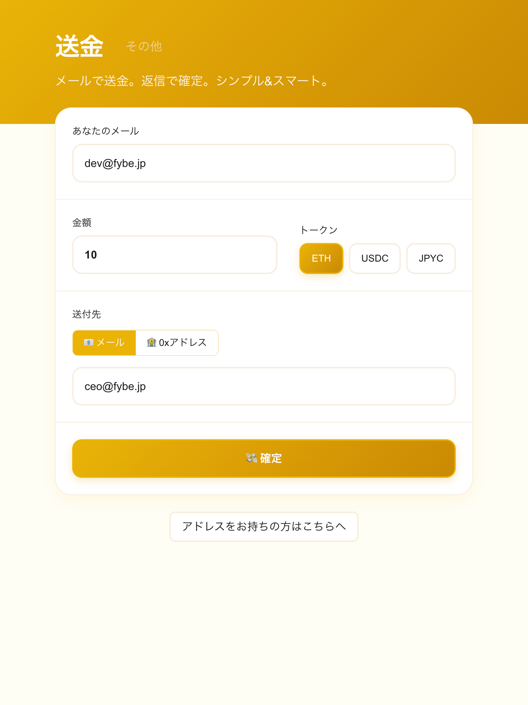

# zk-email-pay — Send Crypto To Email

---

## プロダクト概要

- **何を**: メールアドレスだけでトークン（例: ステーブルコイン/TESTトークン）を送れる「メール駆動ウォレット - zk-Email-pay」の実装・接続・技術検証  
- **なぜ**: Web3 の最大のボトルネックはオンボーディング  
  - 相手がウォレットを持っていなくても「メールに返信するだけ」で受け取れる  
  - 既存の送金 UX を保ちつつ、DKIM と ZK により安全性とプライバシを両立  

---



---

## どう動くか（ハイレベル）

1. 送信者がアプリ/APIから「送金リクエスト」を発行  
2. Relayer が SMTP 経由で相手に確認メールを送信  
3. 受取人はそのまま返信（件名を変えない）  
4. IMAP ブリッジが返信メールを Relayer に転送  
5. Relayer が DKIM 情報をもとに ZK 証明を生成し、コントラクトへ送金  

> 本検証ではメールの DKIM 情報と ZK を組み合わせたエンドツーエンドの技術検証に注力

---

## アーキテクチャ


- 参考  
  - Deepwiki: https://deepwiki.com/zkemail/email-wallet/  
  - ドキュメント: `docs/zkemail/zkemail-emailwallet/*`

---

## 技術スタックと到達点

- **チェーン/コントラクト**: Foundry（Anvil 検証）
- **Relayer**: Rust + Axum
- **Prover**: Python + Flask（Circom 証明生成）
- **メール基盤**: SMTP/IMAP ブリッジ, Mailpit
- **フロント（次段）**: Next.js / Tailwind / shadcn  

到達点
- アカウント作成フロー
- 送金リクエスト
- DKIM/Registry 経路検証
- Gmail SMTP/IMAP 連携

---

## 学びとストーリー（ハッカソン）

- 出発点: ウォレットを持たない人へのオンボーディング
- zk-email を利用できるか調査 → 類似アプリなし  
- Road to ETH Tokyo 技術検証を開始  

学び
- ZK とメール基盤を横断するサービスを E2E 検証できた  
- DKIM/Oracle, メール正規化, Prover 入出力の理解が重要  
- IMAP/件名パースなど実運用要件を具体化  
- ログ可視化の重要性  

---

## 次の ETH Tokyo に向けて

- DKIM Oracle 経路の堅牢化と監視  
- UI/UX の自前実装（Next.js）  
- 受信基盤の選択と信頼性設計  
- Prover 実行オーケストレーション  
- セキュリティ/プライバシ強化  

---

## デモフロー（ローカル Hybrid）

### 1. アカウント作成
```http
POST /api/createAccount {"email_addr":"<user@gmail.com>"}
````

→ Gmail に確認メール → 返信

### 2. 作成確認

```http
POST /api/isAccountCreated {"email_addr":"<user@gmail.com>"} → true
```

---

### 3. 送金リクエスト

```http
POST /api/send {
  "email_addr":"<user@gmail.com>",
  "amount":1,
  "token_id":"TEST",
  "recipient_addr":"<recipient@gmail.com>",
  "is_recipient_email":true
}
```

→ Gmail に確認メール → 返信で実行

---
## 今後（ETH Tokyo に向けて）

* DKIM Oracle（IC）経由の本番経路へ切替
* UI 実装（Next.js）で UX を完結
* SMTP/受信基盤の本番整備
* 監視・レート制限・リトライ・セキュリティ強化
* Circom/Verifier 最適化とテスト拡充

---

## 参考

* Deepwiki: [https://deepwiki.com/zkemail/email-wallet/](https://deepwiki.com/zkemail/email-wallet/)
* 技術メモ: `docs/engineering/zk-email-pay/*`
* 体系ドキュメント:

  * `docs/zkemail/zkemail-emailwallet/*`
  * `docs/zkemail/zkemail-architecture/*`