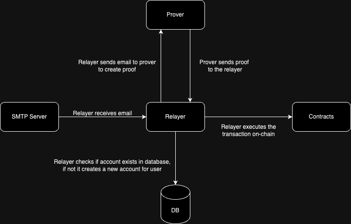

# zk-email-pay — Send Crypto To Email

## プロダクト概要

- 何を: ウォレットアドレスが分からない相手にも、メールアドレスだけでトークン（例: ステーブルコイン/TESTトークン）を送れる「メール駆動ウォレット - zk-Email-pay」の実装・接続・技術検証。
- なぜ: Web3 の最大のボトルネックはオンボーディング。相手がウォレットを持っていなくても「メールに返信するだけ」で受け取れるなら、導入障壁を大幅に下げられる。既存の送金 UX を保ちつつ、DKIM と ZK により安全性とプライバシを両立する。

### どう動くか（ハイレベル）
1. 送信者がアプリ/API から「相手のメールアドレス宛に送金リクエスト」を発行
2. Relayer が SMTP 経由で相手に確認メールを送信（件名にコマンド＋コードを付与）
3. 受取人は届いたメールにそのまま返信（件名を変えない）
4. IMAP ブリッジが返信メールを Relayer に転送
5. Relayer は DKIM 情報をもとに ZK 証明（Prover）を生成し、コントラクトへ送金処理を実行

> 本検証では、メールの DKIM 情報と ZK を組み合わせたエンドツーエンドの技術検証に注力し、Relayer/Prover/Contracts/SMTP/IMAP の各レイヤを結合して動作させました（本番では IC 上の DKIM Oracle 経由の経路で運用予定）。

### アーキテクチャ



- 参考
  - Deepwiki（MCP server で参照）: https://deepwiki.com/zkemail/email-wallet/
  - ドキュメント（本リポジトリ）: `docs/zkemail/zkemail-emailwallet/*`, `docs/zkemail/zkemail-architecture/*`

## 技術スタックと現在の到達点

- チェーン/コントラクト: Foundry（Anvil ローカル検証）
  - EmailWalletCore（Proxy）、ECDSAOwnedDKIMRegistry、TestERC20（ONBOARDING 用）
- Relayer: Rust + Axum（メール受信/送信、ZK Prover 連携、チェーン実行）
- Prover: Python + Flask（ローカル実行、Circom 証明生成）
- メール基盤: SMTP/IMAP ブリッジ（Gmail 連携）、Mailpit（ローカル代替）
- フロント（次段）: Next.js（App Router）/ Tailwind / shadcn（本検証は API と連携優先）

到達点（今回の検証で確認）
- アカウント作成フロー（createAccount → 返信 → on-chain 反映）
- 送金リクエスト（Send N TOKEN to <email> → 返信 → 相手にメール通知）
- DKIM/Registry 経路の検証とメール基盤の連携確認
- Gmail SMTP/IMAP ブリッジとローカル Prover/Anvil の統合作動

詳細ログはエンジニアリングメモ参照: `docs/engineering/zk-email-pay/*`

## 学びとストーリー（ハッカソン）

そもそもの出発点として、ウォレットアドレスを持っていない人にオンボーディングとしてトークンを送るにはどうすれば良いかという発想からスタート。zk-emailを使用することで可能なのではないかと考えた。去年PSEのキャンプでzkを学んでいたのだが、zk-emailをbaseで使えるのか、prover, relayerなどはどうすれば良いのかという点や、そもそもそれを簡単に行えるアプリケーションはないのかをリサーチした。その結果、まだそのようなアプリはないことがわかり、今回road to eth tokyoということで技術検証を始めた。 技術的には可能だということがわかったが、vibeコーディングでは難しい点があり、思い通りのすべての実装はできなかった。circomやコントラクトの書き換えは行わず、技術検証と接続、デプロイに注力した。これだけでも新規制はあるが、ethtokyoではこれを実装したいと考える。

今回の検証で得た学び
- 複雑な ZK（証明生成）とメール（SMTP/IMAP/DKIM）を横断するサービスを自分たちで動かし、E2E の技術検証ができた。
- DKIM/Oracle・メール正規化（canonicalization）・Prover 入出力など、境界面の仕様理解が成功率を左右することを体感。
- IMAP ブリッジの到達性や件名パースなど、現実のメール動作に即した運用要件を具体化。
- ログ可視化（SMTP/Relayer/Contracts）でボトルネックを素早く切り分ける体制の重要性を確認。

特に、次の ETH Tokyo に向けて「独自で実装すべき点」が明確になった：
- IC 上の DKIM Oracle 経由の本番経路の堅牢化と監視（署名者・可用性・エラーハンドリング）
- UI/UX の自前実装（Next.js）で、メール返信ベースの主要フローを誰でも使える形に落とし込む
- 受信基盤の選択（IMAP ポーリング or Inbound Webhook）と再送/整列の信頼性設計
- Prover 実行のオーケストレーション（スケーラビリティ、メトリクス、リトライ）
- セキュリティ/プライバシ（PII 取扱い、鍵・秘密情報の管理）

## デモフロー（ローカル Hybrid）

1) アカウント作成（メール送信）
```
POST /api/createAccount {"email_addr":"<user@gmail.com>"}
→ Gmail に「Email Wallet Account Creation. Code <hex>」が届く
→ そのまま返信（件名を変えない）
```

2) 作成確認
```
POST /api/isAccountCreated {"email_addr":"<user@gmail.com>"} → true
```

3) 送金リクエスト
```
POST /api/send {
  "email_addr":"<user@gmail.com>",
  "amount":1,
  "token_id":"TEST",
  "recipient_addr":"<recipient@gmail.com>",
  "is_recipient_email":true
}
→ Gmail に確認メール、返信で実行（件名を変えない）
```

## 今後（ETH Tokyo に向けて）

- DKIM Oracle（IC）経由の本番経路へ切替（署名者 0x6293… 準拠）
- UI 実装（Next.js / App Router）と送受金の主要 UX をブラウザから完結
- 本番 SMTP（SES/SendGrid 等）と受信基盤（IMAP / Inbound Webhook）整備
- 監視・レート制限・リトライ・セキュリティ（PII ハンドリング）強化
- Circom/Verifier 最適化とテストカバレッジ拡充

## 参考

- Deepwiki（MCP）: https://deepwiki.com/zkemail/email-wallet/
- 本リポジトリの技術メモ: `docs/engineering/zk-email-pay/*`
- 体系ドキュメント: `docs/zkemail/zkemail-emailwallet/*`, `docs/zkemail/zkemail-architecture/*`
