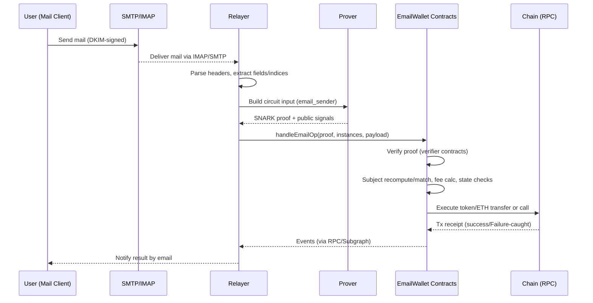

## zk-email-pay フロー（ZK 中心の解説）

本書は、メール→ZK 証明→オンチェーン実行までの一連の流れを、特に ZK（Zero-Knowledge）周りに焦点を当てて説明します。ベースは `vendor/email-wallet` の設計（circuits/contracts/relayer/prover）。

### 全体像（Big Picture）
- ユーザが「件名にコマンド」を含むメールを送る（例: `Send 1 USDC to alice@example.com`）。
- メールは送信ドメインの秘密鍵で DKIM 署名される（通常 RSA）。
- Relayer がメールを受信・解析し、Circom 回路向けの入力を生成。
- Prover が ZK 証明（SNARK）を作る（公開インスタンス＝公開値＋証明）。
- Relayer がコントラクトへトランザクション送信。コントラクトはオンチェーン検証→実行。
- 結果はメール/フロントエンド（Subgraph）で参照。

### シーケンス（送金: メール → 送金実行）

### ZK パイプライン（メール→証明）
- 入力（例: `email_sender.circom`）
  - `in_padded`（ヘッダ生バイトの RSA パディング済み入力）
  - `pubkey`（RSA 公開鍵）、`signature`（DKIM 署名）
  - `in_padded_len`（長さ）、各種オフセット（`sender_email_idx`, `subject_idx`, `recipient_email_idx`, `domain_idx`, `timestamp_idx`）
  - `sender_relayer_rand`（Relayer 側乱数：DoS・リンク性低減用）
- 公開インスタンス（例）
  - `masked_subject_str`（メールアドレス文字を 0 埋めした件名）
  - `domain_name`、`pubkey_hash`、`sender_relayer_rand_hash`
  - `email_nullifier`（リプレイ耐性）、`sender_pointer`
  - `has_email_recipient`（件名に受取メールを含むか）、`recipient_email_addr_commit`
  - `timestamp`
- Prover
  - Circom で witness 生成→`snarkjs` 等で proof 生成。
  - zkey/vkey はビルド成果物として配備（キャッシュ必須）。

### コントラクト検証（オンチェーン）
- Verifier
  - `AllVerifiers` または各用途の Verifier が proof と public signals を検証。
- Subject/コマンド検証
  - コントラクト側で `SubjectUtils` により件名を再計算し、公開インスタンスの `masked_subject_str` と一致確認。
  - コマンド（Send/Swap/NFT/Execute 等）の構文・境界チェック。
- アドレス解決/秘匿
  - 受取人がメール表記の場合は `recipient_email_addr_commit` を利用（アドレスそのものは秘匿）。
  - 未請求資産は Unclaims に積み上げ、`claim` 回路で受取側が後日クレーム可能。
- 料金
  - Relayer 設定の `feePerGas` と実消費ガス＋返金/メール宛加算分から手数料を算出。上限は `maxFeePerGas`。
- 失敗の扱い
  - 実行中のエラーは revert せずに握り、fee は条件に応じて確保（検証失敗は 0）。

### Circom 回路と典型フロー対応
- `email_sender.circom` … 通常の送金/実行コマンド。
- `account_creation.circom` … 初回アカウント作成（招待コード/乱数コミット）。
- `account_init.circom` … DKIM/RSA 署名検証 + 初期化。
- `account_transport.circom` … Relayer 変更やアカウント移送。
- `claim.circom` … 未請求資産の受取（メールコミットに基づく）。
- `announcement.circom` … 第三者コントラクト向けのコミット登録用。

### プライバシ/セキュリティ特性
- 秘匿化: メールアドレスはコミット/ポインタ/マスク済み件名で扱い、オンチェーン秘匿。
- リンク性低減: `sender_relayer_rand` の Poseidon ハッシュを公開値化し、追跡困難化。
- 送信者正当性: DKIM（RSA）検証を ZK 内部で行い、素材を秘匿のまま正当性を主張。
- リプレイ耐性: `email_nullifier` により同一メール再利用を抑止。

### エラーパス/運用観点（ZK）
- 証明生成失敗: インデックス不一致/ヘッダ改行差異/鍵長不整合 → Parser 正規化・テスト充実。
- 期限/時刻: `timestamp` 許容窓の設定（未来/過去過ぎを拒否）。
- vkey/zkey 不整合: バージョン固定とハッシュ検証、逐次ロールアウト。
- パフォーマンス: キュー、キャッシュ、並列ワーカー。p95/99 監視。

### 実装要点（Relayer/Prover）
- Relayer: IMAP/SMTP 受信→ヘッダ正規化→回路入力生成→Prover RPC→Tx 投稿。`.env` に `CIRCUITS_DIR_PATH` `INPUT_FILES_DIR_PATH` `PROVER_ADDRESS`。
- Prover: `snarkjs`/Python で証明生成。Modal などサーバレス実行可。zkey バージョン管理。

### 参考と次の一歩
- 詳細: `vendor/email-wallet/packages/circuits/README.md` / `packages/contracts/README.md` / `packages/relayer/README.md`
- まず dev 環境で `email_sender` フローの E2E を通し、Subgraph/FE 連携まで確認。

---
最終更新: 2025-09-04
