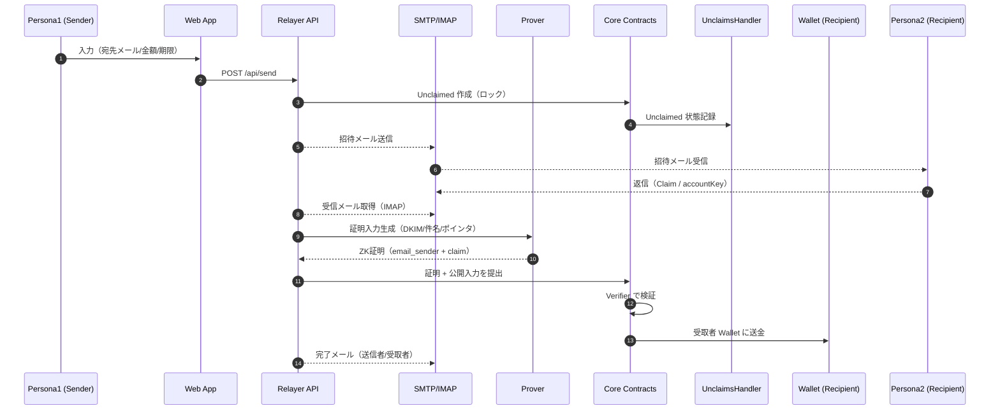

# 全体アーキテクチャ

本章では、システム構成、主要コンポーネント、データフロー、選定技術をまとめます。

## 構成要素
- フロントエンド（Web App for Persona1）
  - 目的: 既存ウォレット保有者が「メール宛に送金」を作成/確認/送信。取消/履歴閲覧。
  - 要素: ウォレット接続（EOA/Safe対応）、送金フォーム、確認モーダル、進行状況表示。
- メール受取UX（for Persona2）
  - 目的: メールのみで受取完了。返信メール or マジックリンク（最小ページ）で完結。
  - 要素: 招待メール、返信解析、最小Web（フォールバック/同意提示）。
- リレーヤー（Relayer）
  - 役割: メール受信、ZK証明生成の指揮、コントラクト呼び出し、ガス肩代わり、通知送信。
  - 構成: IMAP/SMTP連携, APIサーバ, 価格オラクル接続, DB（PostgreSQL）
- プルーバ（Prover）
  - 役割: DKIM署名検証のZK化、メール内容の最小開示証明、各種回路の証明生成。
  - 実行: ローカル/Modal等（`zkemail-emailwallet`の手順に準拠）。
- スマートコントラクト群
  - EmailWalletCore, Handlers（Relayer/Account/Unclaims/Extension）, Wallet, Verifiers, TokenRegistry, DKIMRegistry, PriceOracle。
- DKIM公開鍵レジストリ
  - 役割: DKIMの公開鍵管理。MVPは信頼済みフェッチャ＋固定/キャッシュ。将来はDNSSEC/独自Registryへ。

## チェーン/資産
- チェーン: Base（推奨）
- 資産: USDC（6桁小数）, 将来ETH/他ERC20

## コアデータフロー（高レベル）
1) Persona1 がWebで送金作成（宛先メール, 金額, トークン, 有効期限, メモ）。
2) Web→Relayer API `/api/send`（受取メール宛先の場合はUnclaimed登録）。
3) Core/UnclaimsHandler が「未受領（Unclaimed）」として資金/状態をロック。Relayerは招待メール送信。
4) 招待メールが受取者に配信。
5) Persona2 がメールを受信し、返信（件名/本文テンプレ）or マジックリンクを踏む。
6) Relayer が返信メールをIMAPで取得→DKIM/内容抽出→Proverへ証明要求（`email_sender.circom`/`claim.circom`/`account_*`）。
7) Prover がZK証明を生成→Relayer がCoreに送信（ガス肩代わり）。
8) 検証成功でUnclaimedが消費され、資産は受取側Walletへ。両者に完了通知メール。

### シーケンス図（高レベル）

## アカウント生成/初期化（受取初回）
- account_creation.circom / account_init.circom を利用。
- 招待メールに含める `accountKey`/nonce/期限をテンプレ化。初回受取時にWalletをデプロイ/初期化。
- 以降はメールによる操作でWalletが動作（ガスはRelayer負担/トークンで清算）。

## ガスレス/手数料
- Relayer がトランザクション送信者。`FEE_PER_GAS` と `PriceOracle` で原価計算。
- Fee回収方針（MVP）:
  - 送金作成時に送金額の一部/固定料を差し引く（表示で明示）。
  - または事業者向けは月次課金/プリペイド（範囲外）。

## 設計上の重要ポイント
- メール検証: DKIM署名検証をZKで実装（`docs/zkemail/zk-email-overview.md`）。最小開示（件名テンプレ、宛先コミットメント）。
- 秘匿性: メールアドレスはコミットメント/ポインタでオンチェーン秘匿（`email_sender.circom` 等の仕様に準拠）。
- 再放送防止: `nonce` と `expiry` を公開入力に含め、コントラクトで消費/無効化（イベント監査）。
- 互換性: Email Wallet の Handler/Verifier/Registry 構成を優先採用（拡張容易）。
