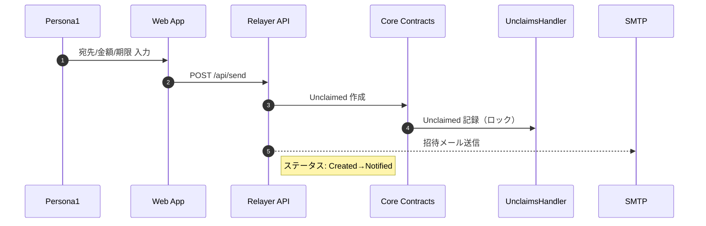
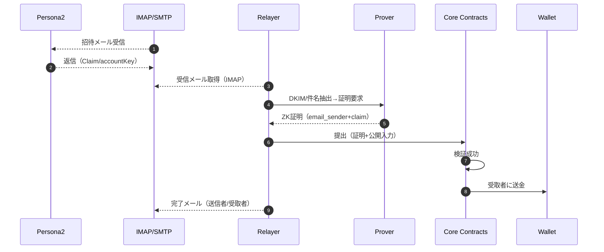

# ユーザーフロー（ペルソナ別）

ペルソナは `docs/user/persona.md` に準拠。

## Persona1（既存ウォレット保有者）: メール宛に送金
1) Webに接続しウォレット署名でログイン。
2) 「宛先メール」「金額」「トークン（USDC）」「メモ/期限（任意）」を入力。
3) 確認画面で手数料/取消条件/期限を明示→送信を確定（トランザクション or 署名）。
4) Web→Relayer `/api/send` 呼び出し。
5) Relayer→Core で Unclaimed 登録。招待メールを宛先へ送信。
6) ステータス: Created → Notified（招待送信済）→ Claimed（受取完了）or Expired/Cancelled。

### シーケンス図（送金作成〜通知）

取消/期限切れ:
- 受取前であれば取消可能（期限内）。Unclaims をキャンセルし送金者へ返金。

## Persona2（ウォレット未保有者）: メールで受取
1) 招待メールを受信（件名例: "You received 10 USDC from Alice"）。
2) 下記のいずれかで受取:
   - A) 返信メール（推奨）: 件名に `Claim` または招待に記載の `accountKey` を含めて返信。
   - B) マジックリンク: 最小Webに遷移し「受取」ボタンのみ。ブラウザ側で署名/秘密は不要。
3) Relayer がメールを取得→DKIM/件名解析/回路入力生成。
4) Prover が `claim.circom` + `email_sender.circom`（返信メール検証）で証明生成。
5) Relayer が Core に提出→Unclaimed 消費→Walletへ着金。
6) 完了メール通知。「残高確認」リンク（閲覧用ページ）と「外部ウォレットへ出金」導線（後日対応可）。

### シーケンス図（受取〜完了）

初回のみの追加ステップ（自動化）:
- `account_creation.circom` / `account_init.circom` を用いて Email Wallet を生成/初期化。招待メールの `accountKey` を利用。

## 失敗/例外系
- 期限切れ: 期限超過は自動的に送金者へ返金（または返金フローを提示）。
- DKIM不一致: 受取メールのDKIM失敗時は再試行案内（別アドレス/時間を置く）。
- 重複請求: `email_nullifier`/`nonce` により再放送拒否、UIで理由表示。
